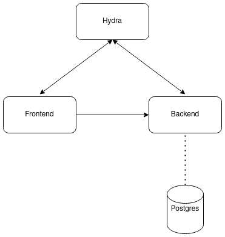

# MojaWallet

**NB!** This is a **demo** wallet and should **NOT** be used in production. It's purpose is to demonstrate the use of Mojaloop in the following cases:
- ATM withdrawal
- POS sale
- Web Payments using Mobile Money and Mojaloop

## Structure
The wallet comprises:
- [Hydra](https://www.ory.sh/hydra/docs/) (OAuth server)
- backend (connected to a SQL database such as PostgreSQL or MySQL)
- frontend



The backend uses a bearer token to protect certain endpoints. The [OAuth flow](https://tools.ietf.org/html/rfc6749) is used to obtain an access token which can then be used as the bearer token.

## Local deployment

### Start Hydra
Hydra can be setup and configured by running the following commands:

```sh
sh scripts/setupHydra.sh
sh scripts/setupFrontendClient.sh
```

### Installing dependencies
The dependencies can be installed by running `yarn` from the root directory.

### Starting the backend
The following commands are to be run in the `packages/backend` folder

```sh
yarn build
yarn start
```
This will start the backend which will listen on `localhost:3000` and tell it to use an in-memory (SQLite) database. The following environment variables can be used to configure the backend:
| Variable                     | Default                                  |   |   |   |
|------------------------------|------------------------------------------|---|---|---|
| PORT                         | 3001                                     |   |   |   |
| KNEX_CLIENT                  | sqlite3                                  |   |   |   |
| ALS_ENDPOINT                 | account-lookup-service.mojaloop.app      |   |   |   |
| TRANSFERS_ENDPOINT           | ml-api-adapter.mojaloop.app              |   |   |   |
| QUOTES_ENDPOINT              | quoting-service.mojaloop.app             |   |   |   |
| TRANSACTION_REQUEST_ENDPOINT | transaction-request-service.mojaloop.app |   |   |   |
| ILP_SECRET                   | secret                                   |   |   |   |

### Starting the frontend
The following commands are to be run in the `packages/backend` folder

```sh
yarn dev
```
This will start the frontend which will listen on `localhost:3000`. The following environment variables can be changed in the `packages/front-end/next.config.js` to configure the frontend:
| Variable                  | Default                                                                                                                                                       |   |   |   |
|---------------------------|---------------------------------------------------------------------------------------------------------------------------------------------------------------|---|---|---|
| PORT                      | 3000                                                                                                                                                          |   |   |   |
| REACT_APP_USERS_API_URL   | localhost:3001                                                                                                                                                |   |   |   |
| REACT_APP_GRANT_URL       | localhost:4445/oauth2/auth?client_id=frontend-service&state=loginflow&response_type=code&redirect_uri=http://localhost:3000/callback                          |   |   |   |
| HYDRA_REDIRECT_URI        | http://localhost:3000/callback                                                                                                                                |   |   |   |
| REACT_APP_LOGIN_GRANT_URL | localhost:4445/oauth2/auth?client_id=frontend-service&state=loginflow&response_type=code&redirect_uri=http://localhost:3000/callback                          |   |   |   |
| HYDRA_CLIENT_ID           | frontend-service                                                                                                                                              |   |   |   |
| PUSHER_KEY                | null                                                                                                                                                          |   |   |   |

## Docker images
Docker images can be built for the `frontend` and `backend` by running `docker build` in the respective directories. For e.g.

```sh
# in the packages/backend folder
docker build -t mojawallet-backend .
```